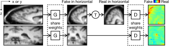
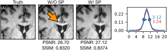
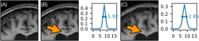

# ESPRESO2: Estimate the Slice Profile for Resolution Enhancement from a Single Image Only Version 2

[](http://www.gnu.org/licenses/gpl-3.0)

| **[Paper][paper]** | **[Docker Image][docker-image]** | **[Singularity Image][singularity-image]** |

## Introduction

This algorithm estimates a slice profile from a single 2D MR acquisition. 2D MR acquisitions usually have a lower through-plane resolution than in-plane resolutions. The rationale of ESPRESO2 is that if we use a correct slice profile to blur a high-resolution in-plane axis, its appearance should match the low-resolution through-plane axis. Therefore, we use a GAN to learn this slice profile by matching the distributions of image patches that are extracted along the in- and through-plane axes.



**Figure 1**: Flowchart of ESPRESO2. **G**: the GAN's generator. **D**: the GAN's discriminator. **T**: transpose.

This algorithm can be used to
* create training data for self-supervised super-resolution algorithms (SSR, [Jog 2016](https://pubmed.ncbi.nlm.nih.gov/29238758/), [Zhao 2020](https://pubmed.ncbi.nlm.nih.gov/33170776/)) that improves the through-plane resolution,
* measure the the difference between in- and through-plane resolutions (as a metric of the performance of these SSR algorithms).

Example results of using it with [Zhao 2020](https://pubmed.ncbi.nlm.nih.gov/33170776/) are shown in Fig. 2. Example measurements of through-plane resolutions (relative to the in-plane resolutions) are shown in Fig. 3.



**Figure 2**: Example results of an SSR algorithm with and without ESPRESO2. The true slice profile (red) and our estimated slice profile (blue) are shown on the right. The yellow arrow points to an artifact.



**Figure 3**: Example measurements of through-plane resolutions. **(A)**: the true isotropic image. **(B)**, **(C)**: the super-resolved images from simulations with blurs of FWHM = 2 and FWHM = 4 pixels, respectively, and their corresponding estimated slice profiles from ESPRESO2. Their FWHMs (1.92 and 2.85) can be used as measurements of the super-resolution performance. Yello arrows point to the differences between these images.

## Installation


The Docker image or [Singularity image][singularity-image] are recommended. To use the Docker image:

```bash
docker pull registry.gitlab.com/shan-deep-networks/espreso2:0.3.1
```

The [Singularity image][singularity-image] was built from the Docker image with Singularity 3.5.2:

```bash
sudo singularity build espreso2_031.sif docker-daemon://espreso2:0.3.1
```

You might need to rebuilt the Singularity image to use it in a lower version of Singularity. See [this link](https://sylabs.io/guides/3.7/user-guide/singularity_and_docker.html#locally-available-images-cached-by-docker) for more details of building a Singularity image from a local Docker image.

The other option is to use `pip`:

```bash
pip install git+https://github.com/shuohan/espreso2
```

## Usage

To use the Docker image, run

```bash
image=/path/to/image
output_dir=/path/to/output_dir
docker run -v $image:$image -v $output_dir:$output_dir --user $(id -u):$(id -g) \
    --rm --gpus device=0 -t espreso2:0.3.1 espreso2-train -i $image -o $output_dir
```

The estimated slice profiles are stored as `$output_dir/result.npy` and `$output_dir/result.png`. To measure the FWHM of the estimated slice profile:

```bash
docker run -v $image:$image -v $output_dir:$output_dir --user $(id -u):$(id -g) \
    --rm --gpus device=0 -t espreso2:0.3.1 espreso2-fwhm $output_dir/result.npy
```

To use the Singularity image, run
```bash
singularity run -B $image:$image -B $output_dir:$output_dir --nv \
    espreso2_031.sif espreso2-train -i $image -o $output_dir
```

If `espreso2` is installed in the host machine, run

```bash
espreso2-train -i $image -o $output_dir
```

[docker-image]: https://gitlab.com/shan-deep-networks/espreso2/container_registry
[singularity-image]: http://iacl.jhu.edu/~shuo/data/espreso2_031.sif
[paper]: https://arxiv.org/pdf/2104.00100.pdf
